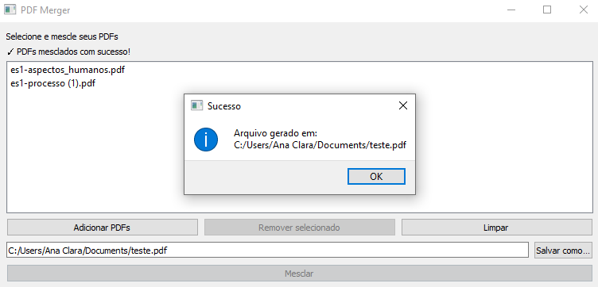

# PDF Merger (Programa + (Web em desenvolvimento))

Projeto para mesclar arquivos **PDF** usando **PyPDF2**.

Inclui:
- **Programa com interface (recomendado)**: `app_gui.py` (PyQt5)
- **Parte web (em desenvolvimento)**: `api/index.py` + `public/index.html`

---

## Como usar o programa (Python)
```bash
pip install -r requirements.txt
python app_gui.py
```

---

## Como usar o `.exe` (Windows)
1. Abra a pasta `dist/`
2. Dê dois cliques no `.exe`
3. Use a interface para:
   - Adicionar os PDFs
   - (Opcional) definir o arquivo de saída
   - Clicar em **Mesclar**



---

## Sobre a parte web
A parte web (Flask + front-end) ainda está **em desenvolvimento** para deploy/hospedagem. Sugestões e correções são bem-vindas.